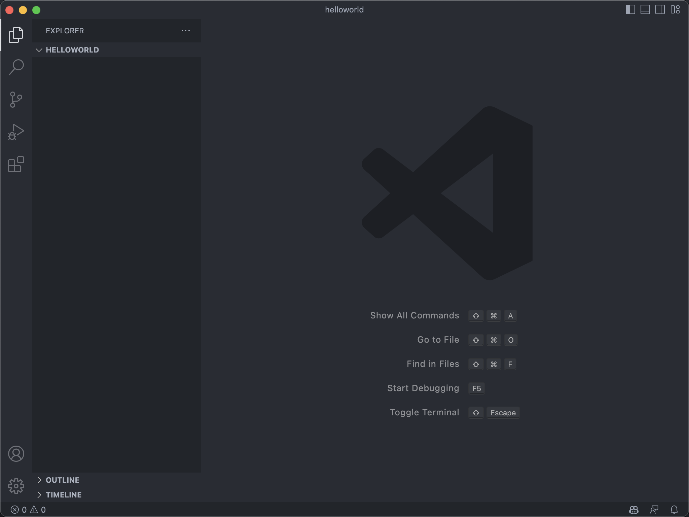
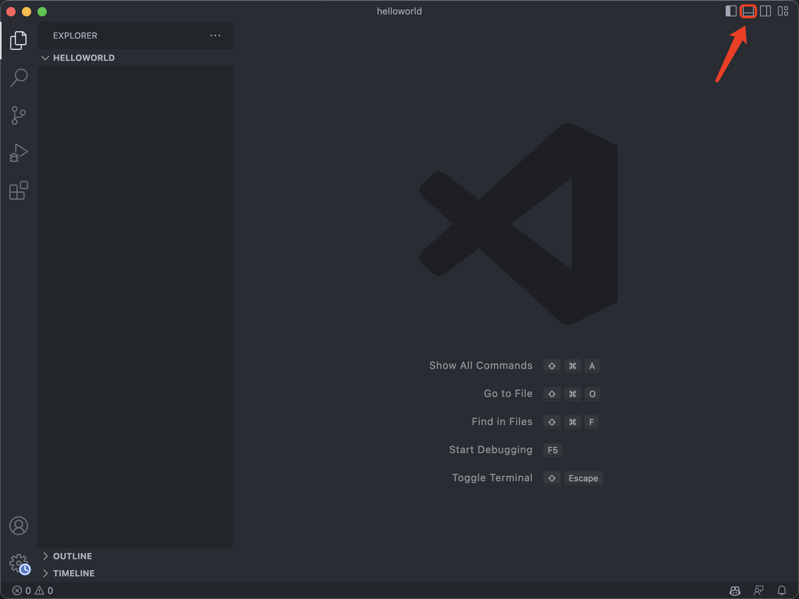
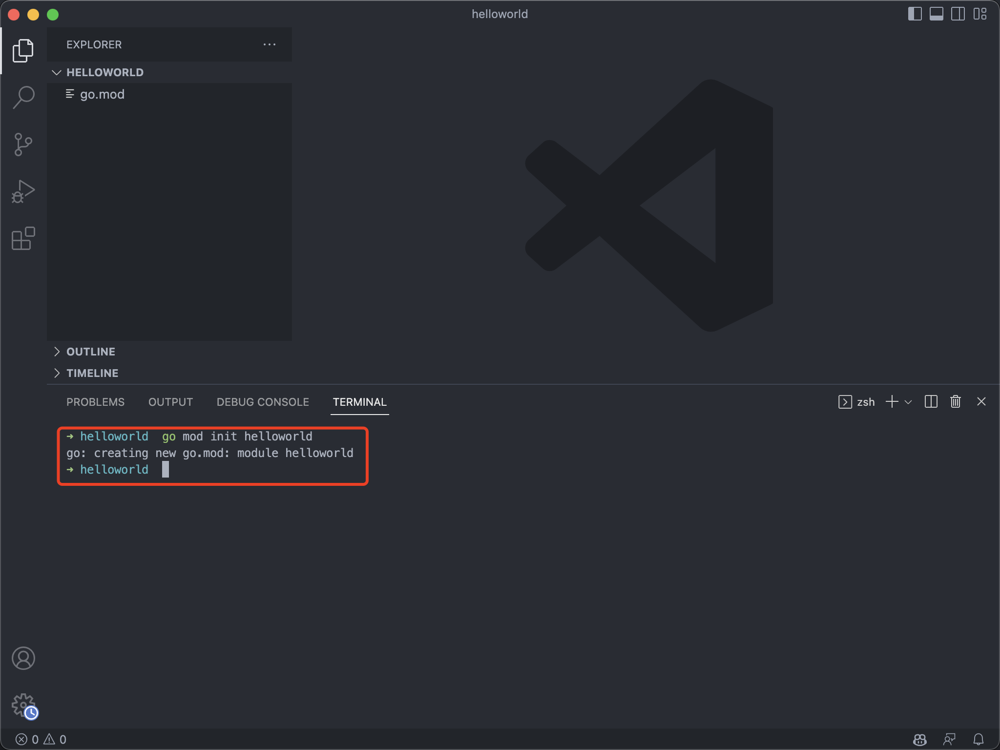
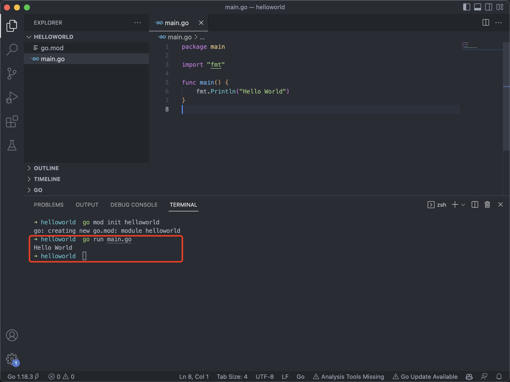

## 概述

我们在完成 Golang 安装后，可以正式进入 golang 开发了，目前比较主流的两款编辑器是 Goland 和 VSCode，本文将介绍如何使用 VSCode 创建一个 golang 项目。

VScode 下载请参考 [VSCode 官网](https://code.visualstudio.com/)。

:::note 温馨提示
当前文档演示的 VScode 版本为 `Version: 1.74.1 (Universal)`，如果你的 VScode 版本不一致，可能会有所差异。
:::

## 安装 Go 扩展

打开 VScode，点击左侧扩展按钮，搜索 `Go`，点击安装。

<center> 安装 Go 扩展</center>

## 创建 Go 工程

打开 VScode，在工作区点击 `Open...`，选择指定的目录或者创建新的文件夹来作为工程目录，我这里选择新建文件夹 ` helloworld`，回车创建工程。

<center>  从 VScode 创建工程 </center>

## 创建 go module

在 VScode 右上角，选择 `Toggle Panel` 或者使用快捷键 `Command + J`，点击 `Terminal`，在终端中输入 `go mod init helloworld`，回车，创建 go module。



<center>   打开 VScode 终端 </center>

## 创建 main.go

在工程目录 `HELLOWORLD` 上新建 `main.go` 文件，输入以下代码：

```go
package main

import "fmt"

func main() {
	fmt.Println("Hello World!")
}
```


<center>  创建 main.go </center>

## 运行程序

在 VScode 右上角，选择 `Toggle Panel` 或者使用快捷键 `Command + J`，点击 `Terminal`，在终端中输入 `go run main.go`，回车，运行程序。

```bash
$ go run main.go
Hello World!
```


<center>  从 VScode 运行程序 </center>